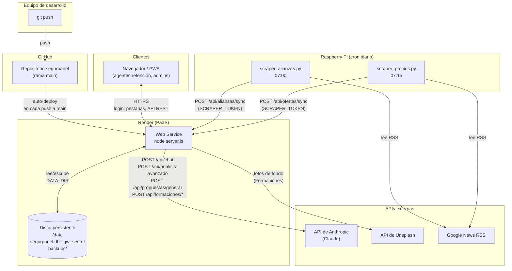

# Arquitectura de SegurPanel

Visión general de cómo encajan entre sí el repositorio en GitHub, el
servicio desplegado en Render, la Raspberry Pi que alimenta datos por cron y
las APIs externas de IA y contenido.

Para el detalle funcional de cada pestaña, ver [DOCUMENTACION.md](DOCUMENTACION.md).
Para instalación y variables de entorno, ver [README.md](README.md).

## Diagrama general

## Componentes

### GitHub

Repositorio único con todo el código fuente (servidor Node.js, frontend
HTML/CSS/JS, scrapers en Python). `data/` está excluido vía `.gitignore`
— nunca contiene datos de producción. Cada `git push` a `main` dispara un
nuevo despliegue automático en Render (auto-deploy).

### Render

PaaS donde vive el servicio en producción:

- **Web Service** — ejecuta `node server.js` (un único proceso Node, sin
  framework, servidor HTTP hecho con el módulo nativo `http`/`https`).
  Render termina TLS por delante del contenedor, así que el tráfico público
  llega siempre por HTTPS.
- **Disco persistente** montado en `/data` (`DATA_DIR=/data`) — imprescindible
  porque el filesystem del contenedor de Render es efímero y se recrea en
  cada despliegue. Sin este disco, la base de datos SQLite, el secreto JWT y
  las sesiones se perderían en cada `git push`.
- **Variables de entorno** — `ANTHROPIC_API_KEY`, `DATA_DIR`, `JWT_SECRET`,
  `SCRAPER_TOKEN`, `UNSPLASH_ACCESS_KEY` (ver
  [README.md](README.md#variables-de-entorno)).

Dentro del propio Web Service, `server.js` delega en módulos internos:
`db.js` (SQLite), `auth.js` (login/JWT/roles), `analisis.js` (extracción y
anonimización de contratos), `formaciones.js` (generación de PPTX),
`backup.js` (copia diaria de la BD), `push.js`/`email.js` (notificaciones).

### Raspberry Pi

Equipo siempre encendido, fuera de Render, que ejecuta por `cron` dos
scripts Python (solo librería estándar, sin dependencias que instalar):

- `scraper_alianzas.py` (07:00) y `scraper_precios.py` (07:15) consultan
  **Google News RSS** buscando menciones relevantes de las empresas de
  alarmas competidoras, y envían lo que detectan de nuevo al Web Service de
  Render vía HTTPS (`POST /api/alianzas/sync` y `POST /api/ofertas/sync`),
  autenticados con un secreto compartido (`SCRAPER_TOKEN`) — no usan sesión
  de usuario porque quien llama no es un navegador.
- Cada script mantiene una caché local (`*_cache.json`) para enviar solo lo
  que cambia de un día a otro.
- Este componente es **opcional**: sin él, la app funciona igual, solo que
  Alianzas y Ofertas no se actualizan solas.

### APIs externas

- **API de Anthropic (Claude)** — el único proveedor de IA de la app.
  `server.js` es el único que tiene la clave (`ANTHROPIC_API_KEY`); el
  navegador nunca la ve. La usan: el chat del IA Assistant
  (`claude-haiku-4-5-20251001`), el Análisis Avanzado de contratos, el
  Generador de Propuestas y Formaciones (`claude-opus-5`).
- **API de Unsplash** — fotos de fondo reales para las diapositivas
  generadas en Formaciones. Opcional; sin clave, Formaciones sigue
  funcionando sin fotos.
- **Google News RSS** — fuente pública que consultan los scrapers de la
  Raspberry Pi (no la consulta el Web Service directamente).

### Clientes

Navegadores de escritorio y móvil de los agentes de retención/ventas y de
los administradores. SegurPanel es una PWA instalable (`manifest.json` +
`sw.js`): una vez visitada por HTTPS, queda cacheada para funcionar sin
conexión (salvo el IA Assistant, que necesita hablar con `server.js` →
Anthropic). Toda la comunicación cliente↔servidor pasa por HTTPS con
cookies de sesión `httpOnly`.

## Flujos de datos clave

**Autenticación:** navegador → `POST /api/auth/login` → `auth.js` valida
contra `db.js` (bcrypt) → cookie JWT `httpOnly` firmada con `JWT_SECRET` →
sesión registrada también en SQLite (`sessions`) para poder revocarla.

**Análisis de un contrato:** navegador sube el archivo → `server.js`
(`multer`) → `analisis.js` extrae texto (OCR si es imagen) y **anonimiza**
datos sensibles → se detecta empresa/provincia/tipo → se guarda en SQLite
(Repositorio) → se genera PDF → en paralelo, `server.js` llama a la API de
Anthropic para el Análisis Avanzado (cláusula por cláusula) del mismo
contrato.

**Alianzas/Ofertas:** Raspberry Pi (cron) → Google News RSS → Web Service
de Render (`SCRAPER_TOKEN`) → SQLite → (solo Alianzas) cola de moderación
del Super Admin → visible para todos los roles una vez publicada.

**Backups:** `server.js` ejecuta `backup.js` cada día a las 02:00 (timer
interno, sin cron externo) → copia `segurpanel.db` a `DATA_DIR/backups/`,
manteniendo los últimos 7 días — protege contra corrupción de datos o
errores humanos sin depender de backups del propio disco de Render.

## Seguridad y aislamiento

- La clave de Anthropic y la de Unsplash viven solo como variables de
  entorno del Web Service de Render; nunca llegan al navegador ni al
  repositorio.
- El secreto `SCRAPER_TOKEN` es el único mecanismo de autenticación entre
  la Raspberry Pi y Render — no hay sesión de usuario para esas llamadas, y
  los endpoints rechazan cualquier petición si el secreto no está
  configurado en el servidor.
- `data/` (SQLite, secreto JWT, backups) está excluido de git en las tres
  ubicaciones donde puede existir: repo local, checkout de Render y
  Raspberry Pi — solo vive en el disco persistente montado en `/data`.
- Los datos personales de los contratos (nombres, DNI/NIE/NIF/CIF,
  direcciones, teléfonos, emails, datos bancarios) se anonimizan **antes**
  de guardarse en el Repositorio o en las Estadísticas: lo que persiste es
  empresa + provincia + tipo + fecha + cláusulas, nunca el documento
  original con datos identificables.
